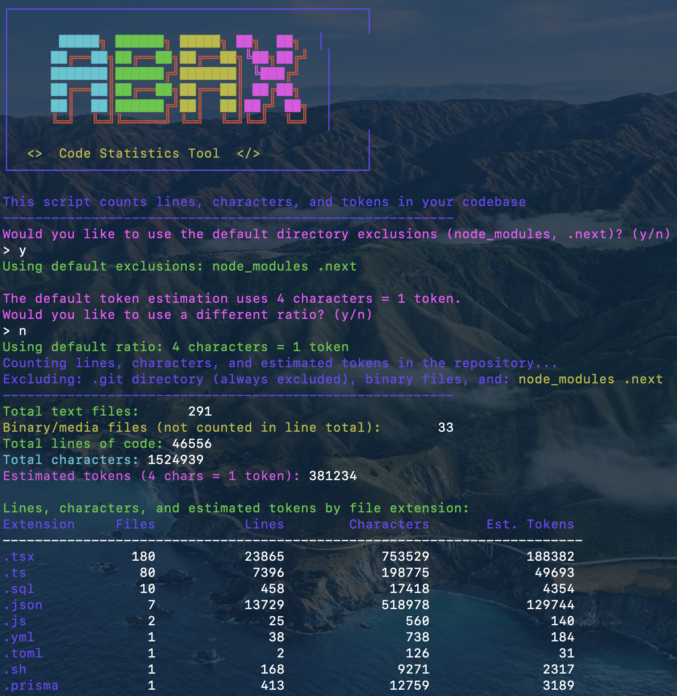

# Abax - Code Statistics Tool

Abax is a simple shell script that provides statistics about your codebase, including line counts, character counts, and very rough token estimations. This tool is particularly useful for developers who want to understand the size and composition of their repositories or estimate token usage for large language models.

### Why the name?

"Abax" (ἄβαξ) is an ancient Greek word referring to a calculating table or counting board - one of the earliest mathematical tools used for calculations and measurements. The first record of an abacus may have been in Sumeria between 2700 and 2300 BC. It held a table of successive columns which delimited the successive orders of magnitude of their sexagesimal (base 60) number system.

## Features

- 📊 **Detailed Statistics**: Count lines, characters, and estimate tokens in your codebase
- 🔍 **File Type Breakdown**: Get statistics broken down by file extension
- 🚫 **Customizable Exclusions**: Specify which directories to exclude from counting
- 📏 **Token Estimation**: Customize the character-to-token ratio for more accurate estimations
- 🖼️ **Binary File Handling**: Automatic detection and separate reporting of binary/media files
- ⏱️ **Performance Metrics**: Displays execution time for performance monitoring

## Installation

1. Download the `abax.sh` script to your repository:

```bash
curl -o abax.sh https://raw.githubusercontent.com/mohamm-ad/abax/main/abax.sh
```

2. Make the script executable:

```bash
chmod +x abax.sh
```

## Usage

Run the script from the root directory of your repository:

```bash
./abax.sh
```

> **Note:** For accurate statistics, always run Abax from the root directory of your project repository.

### Interactive Options

The script will prompt you for:

1. **Directory Exclusions**: 
   - Choose whether to use default exclusions (`node_modules`, `.next`)
   - Or specify custom directories to exclude

2. **Token Estimation Ratio**: 
   - Use the default ratio (4 characters = 1 token)
   - Or specify a custom ratio for more accurate estimations

### Example Output


...


## Customization

### Default Exclusions

By default, Abax excludes:
- `.git` directory (always excluded)
- `node_modules` directory (optional default)
- `.next` directory (optional default)
- Binary and media files from line/character counts

### Binary File Detection

Abax automatically detects and separately reports on binary/media files with these extensions:
`png`, `jpg`, `jpeg`, `gif`, `ico`, `svg`, `mp4`, `mp3`, `wav`, `pdf`, `ttf`, `woff`, `woff2`, `eot`, `DS_Store`, `tsbuildinfo`

### Token Estimation

The default token estimation uses a ratio of 4 characters = 1 token, which is a very rough general approximation. For more accurate estimations specific to certain models, you can customize this ratio when prompted.

## Notes

- Token estimation is approximate and may vary compared to actual tokenization by language models
- The script performance depends on the size of your codebase; large repositories may take longer to process
- The `.git` directory is always excluded as it contains binary files and repository metadata

## License

[MIT License](./LICENSE)

## Contributing

Contributions are welcome! Please feel free to submit a Pull Request. 